# 家教中介的「信息税」：你的信息费究竟买的是什么？

一次讲课两个多小时拿到的报酬仅几十元，信息费却高达小一千——这不是金融诈骗，而是当代大学生家教市场的真实生存图景。

# 一、中介吸血全流程：你的课时费是如何消失的？

家教中介已形成一套精密剥削系统，从接单到退费步步设卡。

## 1.1 投简历资格：百元押金门槛

中介以“防止投递后爽约”为由收取100元押金，本质是筛选支付意愿强的学生，同时建立初步资金池。若学生“爽约”（如拒绝不合适订单），中介最高可没收100元；但若中介派单失败、信息虚假或家长取消，学生通常仅获全额退费（无补偿）。权责严重不对等！

此时你尚未获得任何有效资源，却已承担第一笔风险。

## 1.2 信息费：阶梯式收割公式

  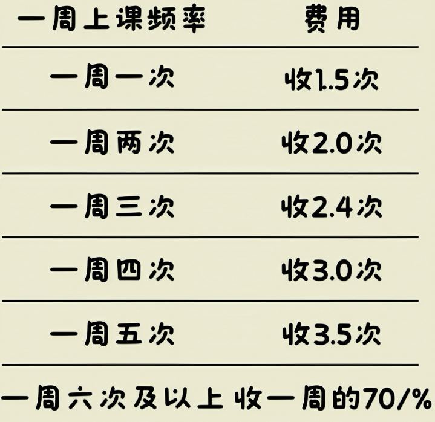
  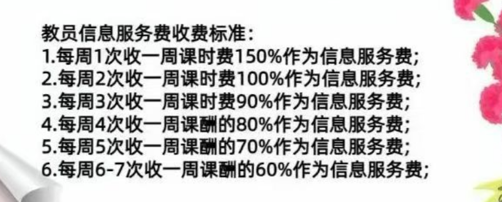
  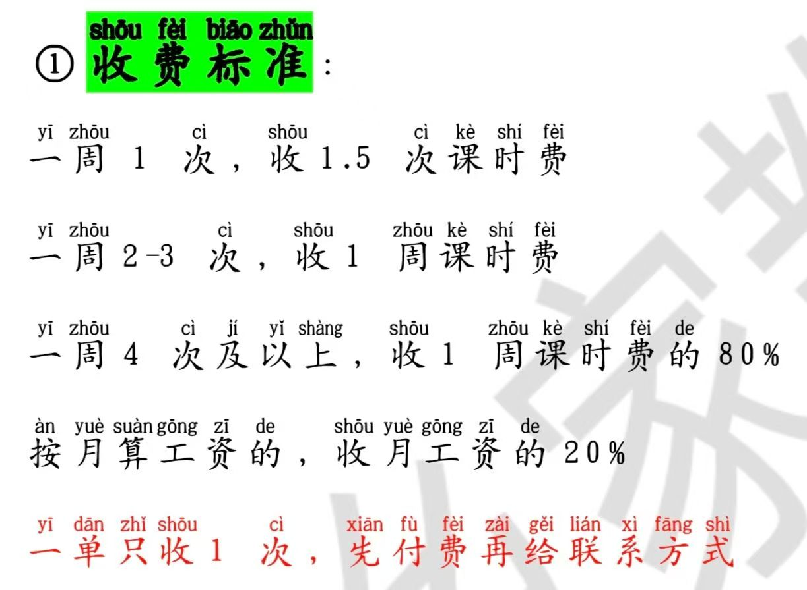

以上图片并非笔者随意编写，而是从大学生朋友那里拿到的家教中介的真实收费标准。笔者相信有同学已经认出其中某些海报属于哪个机构。

假设某家教单时薪70/h，每次上课3h，以第一个收费标准为例，则信息费如下

| 上课频率 | 收费倍数 | 信息费         |
| -------- | -------- | -------------- |
| 一周1次  | 1.5倍    | 315元          |
| 一周2次  | 2倍      | 420元          |
| 一周3次  | 2.4倍    | 504元          |
| 一周4次  | 3.0倍    | 630元          |
| 一周6次+ | 70%      | 882元(按6次计) |

若家长初始要求为“每周3次，每次2-3h”，中介直接按3h×3次顶格计算。如果实际时长未达3h，机构会退给你。但是你的钱一定要在他们手上保管才行。

## 1.3 试讲陷阱：失败也要剥层皮
以下是某机构的信息费退费注意事项。!!!该事项是付完信息费才告知!!!并未在付信息费前与学生沟通，只字未提!

  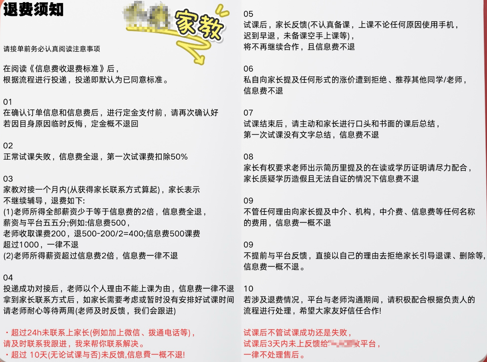

| 条款                                    | 表面规则         |                                                                                                          | 除此之外                                          |
| --------------------------------------- | ---------------- | -------------------------------------------------------------------------------------------------------- | ------------------------------------------------- |
| **2.试课失败退费** "至少还有67.5元"  | "没白忙，有保底" | • 备课+3小时上课+通勤=时薪22.5元 • 中介转卖家长再赚几百元 • 你成一次性耗材                         | **施舍式剥削** 若提前知晓3h60多块，你还愿意吗? |
| **3.薪资超2倍不退** "说明你赚得多呀" | "多劳多得很公平" | • 劳动价值1000元=月收入500元 • 总收入达标日即信息费献祭日                                             | **驴前胡萝卜** 你越努力，中介越富有            |
| **5.文字狱** "无书面总结即扣费"      | "保障教学质量"   | • 暴雨夜通勤2小时→忘发总结→白干 • 口头总结无效→中介需要你保障机构信誉                                 | **形式主义屠刀** 你的汗水不抵一封邮件          |
| **6.禁言令** "提涨价/荐他人不退费"   | "维护服务秩序"   | • 封锁教师人脉→禁止建立独立渠道 • 维护中介定价权——你不配再议价                                        | **喉舌枷锁** 闭嘴，否则血汗钱归零              |
| **9.信息坟场** "提中介费即活埋"      | "避免纠纷"       | • 强制沉默契约→泄密即信息费清零   • 抽成比例成为不可言说的禁忌                                        | **现代指鹿为马** 你必须假装吸血鬼不存在        |
| **红字.3天生死线** "及时反馈很简单"  | "高效处理售后"   | • 吞费陷阱→超时即全额没收信息费 • 你的“迟到”是中介的创收密码  • 除了教学质量，规则更像为扣钱而服务 | **合法赖账密码** 三天是中介的免罪金牌          |

> *黑色幽默剧场——*  
> **你**：试课失败为什么家长给半价你们还再扣一半？  
> 
> **中介**：没办法，老板规定啦~(🤷)
> 
> **老板**：我又不出面对接基层人员~(🤭)
> 
> **家长**：他们收你1000？！我刚付了500！(😱)  

“横竖睡不着，满眼都是`扣钱`两个字。”

## 1.4 信息封锁：删除家长并录屏自证

退费前中介要求以保护隐私为由强制教师**删除家长**联系方式并全程录屏——这一关键条款在接单时被刻意隐藏，而是在试课失败后退信息费前突然设卡。这真的是为了保护隐私，还是维护中介对“资源”的垄断控制？

**大致话术:** 由于不再上课，为保护您(家长)的个人隐私，这边会先将您删除。如果后续有需要可以再联系机构。感谢+祝福~~~

**中介:** "录屏：把话术发给家长,然后拉黑删除。先拉黑再删除,不然信息费会扣xxx块!"

当中介要求你发送那条看似礼貌的消息时，实质在逼你签署一份隐形协议：“我自愿放弃与家长的一切未来连接，承认中介对客户资源的永久所有权，并接受其无限次转售我的劳动机会。”

保护隐私不需要做到删除甚至拉黑这种地步，目的在与切断教员与家长的直接联系，维护中介的信息垄断权。拉黑可以防止家长再把教员加回来。
- 消息中“**请联系机构老师**”是关键陷阱——后续需求仍被中介截流，教师彻底沦为“一次性耗材”。  
- 录屏自证忠诚实质是逼教师签署“放弃资源主权”的**屈辱契约**，未执行则扣押金，形成暴力闭环。

## 1.5 伪所有权陷阱：信息费到底买了什么？

不得不承认的是，家长是机构的重要资源，最开始得家长资源确实属于机构。但中介究竟是在合理行使资源所有权，还是以“所有权”之名实施系统性剥削？

中介的逻辑陷阱：“我（中介）获得了家长资源 → 我卖给你（教师）一次服务机会 → 服务结束你就该销毁资源。”

**家长信息属于谁？** 

中介对“家长资源所有权”的主张没有法律支持、无理且荒谬！只反映了中介商业模式对控制权而非服务价值的病态依赖。

《个保法》[第四十四条](http://www.npc.gov.cn/npc/c2/c30834/202108/t20210820_313088.html#:~:text=%E7%AC%AC%E5%9B%9B%E5%8D%81%E5%9B%9B%E6%9D%A1)规定，个人对其个人信息的处理享有知情权、决定权，有权限制或者拒绝他人对其个人信息进行处理。中介的强制删除要求是赤裸裸的越权。是否删除联系方式、是否继续联系教师，唯一决定权在家长手中。中介无权代替家长行使权利。其真实目的是切断教师与家长建立独立联系的可能性，为后续对同一家长资源反复收费（更换教师） 扫清障碍——这是对“隐私权”概念的系统性滥用与亵渎。

**你支付的信息费究竟是购买什么？**

若购买“家长联系方式”，则应永久拥有联络权；若购买“一次撮合服务”，则服务完成后中介无权干预后续关系。

中介实际在模糊概念：既按信息买断制收费，又按服务制控制使用权。

这违反了市场规律，正常市场中（如房产中介），买家通过中介结识房主 → 交易完成后仍可直接联系房主续租/维修，中介无权要求“删除房主微信”。

强制删除操作让同一家长下次需求出现时，中介可再次收取信息费；也让教师无法积累客户资源，永远依赖中介投喂“一次性订单”。这不是保护资源，而是制造奴役。中介未承担所有者义务，却滥用所有者权利。

# 二、为什么很多家教平台都以群聊方式发布？
当你在微信/QQ群看到刷屏的家教单时，是否疑惑：为何没有淘宝式平台？答案藏在监管与利益的灰色地带。
## 2.1 举报难度：群聊的“隐身斗篷”
- 群内信息瞬间刷屏，收费规则常以口头约定为主，难以固定证据，举证困难；
- 中介宣称“只提供信息，纠纷与平台无关”，而正规平台需承担审核责任
- 封群后立即建新群，违法成本趋近于零，方便转移

## 2.2 监管真空：家教的“三不管”困境
家教市场长期处于监管灰色地带
- 无准入标准，无需教师资格证，简历注水成常态[（“经历自己写，怎么丰富怎么来”）](http://kbcmw.com/html/jrlc/53492.html)

- 中介对教学质量零管控，出事即甩锅[(“是家长和老师双方之间的事”)](http://kbcmw.com/html/jrlc/53492.html)

- 大学生维权时面临 “三无”困境——无合同、无凭证、无投诉渠道。[“付千元中介费倒贴打工”](https://wxb.xzdw.gov.cn/wlaq/yjtb/202507/t20250730_591495.html)

## 2.3 成本优势：群聊的“吸金利器”
- 零平台成本：无需开发APP/网站，省去维护费用
- 资金无监管：信息费直入私人账户，逃避税务稽查
- 规模复制：一个管理员可运营20+500人群，边际成本趋零

>对比正规中介：[杭州神舟家教](http://daxuesheng.vipjiajiao.com/Charges/chargetch.asp)虽也收中介费，但明码标价（专职教师课时费20~25%提成）且需签合同；[石家庄师大家教中心](https://sjz.eduease.com/zuojiajiao/zshoufei.php)收取首周[2次课费](https://sjz.eduease.com/zuojiajiao/zshoufei.php#:~:text=%E8%AF%BE%E6%97%B6%E8%B4%B9%20*2)为上限(大学生)，[上限不超过150元](http://sjz.365lzw.cn/News/2011/20111230123439.html#:~:text=%E5%8E%9F%E5%88%99%E4%B8%8A%EF%BC%8C%E4%BF%A1%E6%81%AF%E6%9C%8D%E5%8A%A1%E8%B4%B9%E4%B8%8D%E4%BC%9A%E5%A4%9A%E4%BA%8E150%E5%85%83)，不论上课频率。

家教平台寄生在微信QQ群聊里，绝非偶然，而是一套精心设计的生存策略。信息如流水般刷过，不留痕迹，收费规则全靠口头约定，让举报者抓不住把柄；更是他们的“免责声明”，一句“纠纷与我无关”就能甩开所有责任。封群？不过是打一枪换一个地方，建新群的成本几乎为零。拿回信息费？又没签合同凭什么说是你的钱？报警？几百块警察都懒得搭理。

# 三、对抗策略：如何与家长联手？

## 3.1 信任建立时机——试课后面对面交流的“黄金窗口期”

试课后当家长说出类似“下周开始正式上课吧”、“孩子挺喜欢你的”之类的话时，可以做出一些试探性的尝试...

>家长，我想和您商量个事儿~
>
>我通过机构老师得到您的联系方式的同时，也向机构缴纳了xxx信息费。
>
>其实我能理解机构需要运营，只是我不理解为什么收费这么高。
>
>想问问您愿不愿意帮我打个配合，找个不继续家教的理由反馈给机构，加装这次试课失败。
>
>只有试课失败机构才会退还我的信息费。
>
>如果你愿意的话我可以立刻免去本次试课费(或者xxx)，相当于把给机构的钱投入到您孩子的教育上。
>
>这不代表您孩子的老师缺乏诚信，我只是讨厌机构的规则，不然我不会冒险给您讲这些。
>
>您完全不用有压力，不愿意也没关系，就当我没说过，继续走机构我照样全力教。

  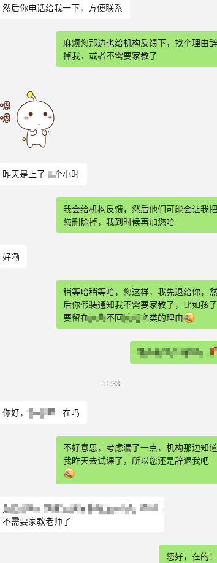
  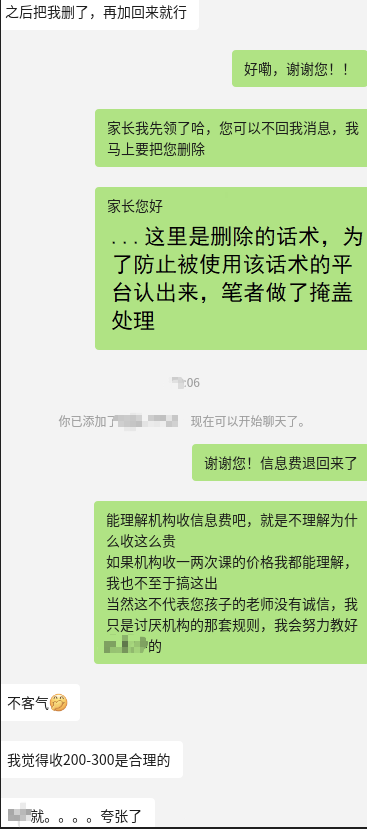

**不止笔者本人，有很多人尝试过**，已经有人成功过，也有人失败过。

  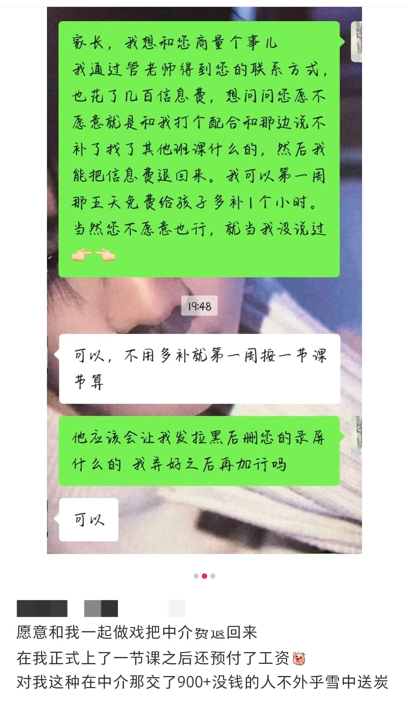
  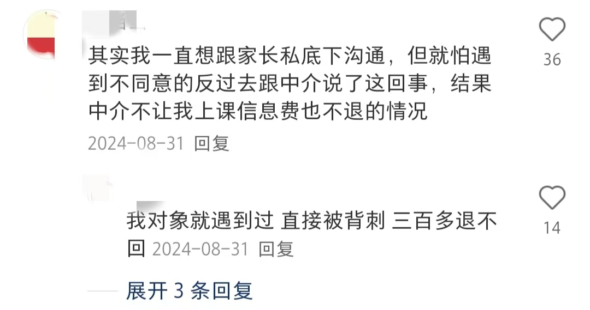

## 3.2 家长凭什么与你合作？

用“把给机构的钱投入到您孩子的教育上”触发家长共情。

在沟通过程中需要反复强调“机构服务有价值，但价格畸高”，避免家长觉得你过河拆桥，不讲信用。

教师主动承担“跳单”的利益风险，家长零成本。

只要呈现足够清晰的利益地图，家长会成为坚定同盟军——毕竟没人愿意为中介的保时捷买单。

## 3.3 规则不公下的自保绝非背德，你从未“同意”过他们的条款

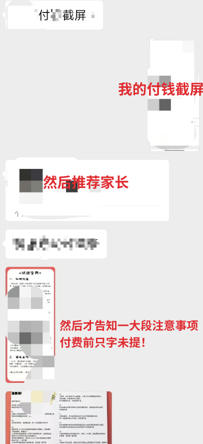

当你支付信息费前，中介刻意隐藏了最严苛的条款（如强制删除家长、全额没收规则）。这些条款像埋伏在合同里的地雷，直到你付完钱才被引爆——这根本不是契约，而是有预谋的欺诈。

《民法典》[第496条](https://gafdc.cn/ws/news/fzzxnewsinfo.aspx?id=225214#:~:text=%E7%AC%AC%E5%9B%9B%E7%99%BE%E4%B9%9D%E5%8D%81%E5%85%AD%E6%9D%A1)：“提供格式条款的一方未履行提示或说明义务，致使对方未能注意相关条款的，对方可主张该条款不成为合同内容。

这意味着：
- “强制删除家长信息”
- “试课失败扣全款”
- “3天超时吞信息费”

——这些付款后才亮出的刀，法律上视为 “根本不存在”！你从未真正同意过它们。
当中介用你的钱买来的刀架在你脖子上时，反抗不是背德，而是对掠夺的正当防卫。不必感到压力，错的不是你。

# 四、笔者本人也是生意人

笔者本人是学生，但也算个生意人(具体不便透露)，客户主要是大学生群体。我做生意并不会为难客户，更不会在客户犯错误的情况下各种理由高收费。

所以我并不是完全与中介对着干，站着说话不腰疼，完全不顾中介的利益。

我只是想不通，同为生意人，怎么会有人把生意做成这个鬼样子，一定要从合作伙伴那里压榨压榨再压榨？！

  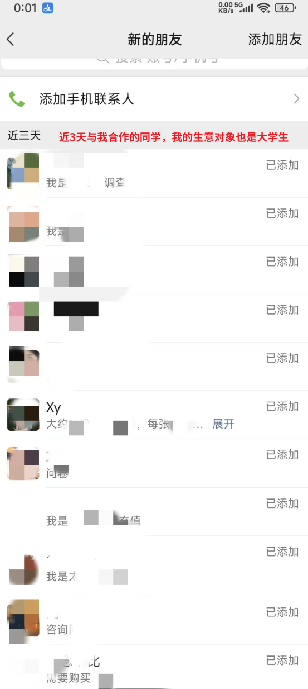
  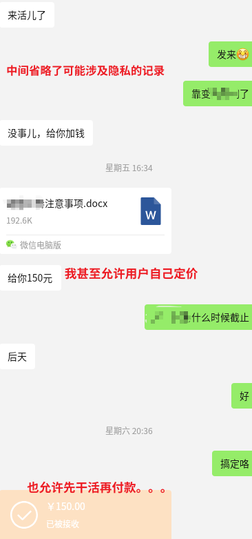

  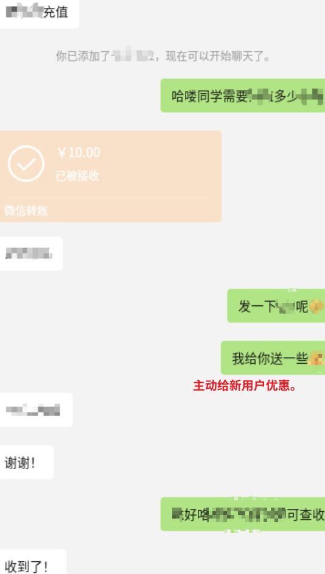
  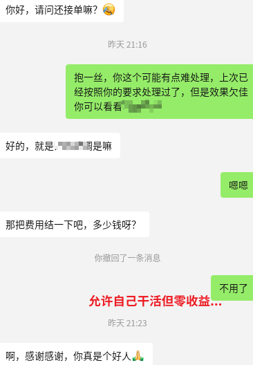

# 五、写给行业：不要摧毁，只要改变

揭露乱象绝非为毁灭家教行业——既无此意愿，更无此必要，亦无此能力。家教中介有其不可替代的桥梁价值：它们降低了大学生兼职的门槛，整合了分散的供需信息，为家长提供了初步的筛选保障。这本身是一个值得存在的服务。

笔者反对的，不是中介的存在，而是披着服务外衣的掠夺性规则。相信不止笔者以个人在期待：建立透明、公平、可持续的协作机制：

- 阶梯费率公示：中介须清晰公示不同课酬区间对应的信息费比例（可参考[石家庄师大家教中心官网](http://sjz.365lzw.cn/News/2011/20111230123439.html)等正面案例），杜绝暴虐抽成。
- 费用性质明确：明确告知家长和教师，支付的费用中多少是教师课酬，多少是中介服务费。打破“信息坟场”。
- 设置收费上限：单次信息费或抽成比例，应 ≤ 教师单周课酬的 40%(或2~3节课程)。超过此限即为掠夺性定价，严重背离服务价值（对比：房产中介费率通常在 0.5%-3%）。
- 废除“全额没收”陷阱：反馈超时、沟通瑕疵等非根本性违约，应设置阶梯式违约金（如10%-40%），而非扣除全部信息费。
- 保障基本劳动所得：试课应有合理保底报酬（覆盖备课、通勤、授课时间），远高于象征性的67.5元。
- 解除不合理枷锁：取消禁止教师议价、禁止推荐同行、压制议价权的“禁言令”。教师应有权根据自身价值和市场行情进行沟通。

如果信息费没有如此高昂，也许不会有这篇小作文，也就没有中介被“作局”，没有学生愿意冒着被家长告密和血本无归的风险向家长提及信息费。当前畸形的规则，迫使学生在高压下沉默，甚至在极端剥削下不得不寻求与家长建立直接联系以保全劳动价值。这绝非健康生态，而是规则扭曲催生的无奈自保。

如果有人可以通过此篇经验贴拿回信息费，我会无比欣慰。

愿后来者可以见证规则的进化。

  <ul style="list-style: none; padding: 0; margin: 0; display: flex; gap: 20px; flex-wrap: nowrap;">
    <li><a href="https://w06112.github.io/home_teacher/" target="_blank" style="color: #0066cc; text-decoration: none;">Github Page</a></li>
    <li><a href="https://h5npce.nocode.host/" target="_blank" style="color: #0066cc; text-decoration: none;">Nocode Page</a></li>
    <li><a href="https://home-teacher.pages.dev/" target="_blank" style="color: #0066cc; text-decoration: none;">Cloudflare Page</a></li>
    <li><a href="https://gitee.com/skugga/home_teacher/blob/master/README.md" target="_blank" style="color: #0066cc; text-decoration: none;">Gitee Page</a></li>
  </ul>

